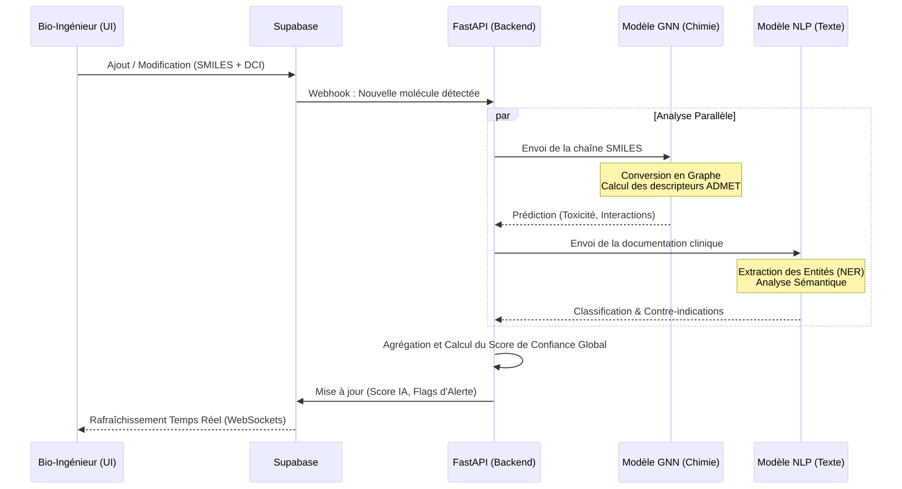

# ADWYA PharmaTech Hub

<p align="center">
  
</p>

<p align="center">
  <strong>Plateforme Intégrative d'Intelligence Moléculaire, de Formulation in silico et de Résilience Supply Chain</strong><br/>
</p>

## À propos du Pivot Stratégique (V2)

La plateforme ADWYA a évolué pour s'adapter aux défis critiques de l'industrie pharmaceutique mondiale (2024-2026). Initialement conçue comme un catalogue d'ingrédients, l'outil est aujourd'hui une plateforme "DeepTech" conçue pour résoudre les points de douleur réels d'un bio-ingénieur :

1. **La Formulation Assistée par Ordinateur** : Prédiction des incompatibilités galéniques avant la phase de paillasse.
2. **L'Intégration Bio-Informatique** : Rapatriement temps réel des données moléculaires structurées (SMILES, propriétés ADMET, spectres 3D).
3. **La Résilience Structurale (Supply Chain)** : Face aux pénuries pharmaceutiques mondiales, l'outil croise les données des Principes Actifs (API) avec le maillage géopolitique et industriel pour suggérer des fournisseurs alternatifs.
4. **Conformité Réglementaire (GMP / FDA)** : Infrastructure de logs inaltérables garantissant la traçabilité de bout-en-bout.

---

## Fonctionnalités (Roadmap Actuelle)

### 🔬 Laboratoire In Silico (R&D)
- Import et analyse des données chimiques profondes (connecté aux bases ChEMBL / PubChem).
- Visualisation interactive des molécules en 3D (Viewer WebGL embarqué).
- Moteur de scoring d'interface : évaluation de la viabilité d'un ensemble (Principe Actif + Excipients) limitant les itérations ratées en laboratoire.

### 🏭 Résilience & Supply Chain
- Analyse granulaire de l'origine des ingrédients.
- Prédiction algorithmique des risques de rupture (via métadonnées temporelles et fournisseurs).

### 🛡️ Conformité et Sécurité
- Intégration des standards d'audit stricts (Audit Trail type 21 CFR Part 11).
- Versioning crypté des modifications de formulation.

---

## Architecture de la Plateforme

L'architecture est pensée pour l'entreprise moderne :

- **Frontend** : Next.js 16 (React 19), ultra-rapide avec le compilateur Turbopack. Architecture Cloud-native.
- **Backend & Auth** : Supabase. Fournit le moteur PostgreSQL, une authentification sécurisée, et des politiques de Row Level Security (RLS) pour cloisonner la R&D de la Supply Chain.
- **Design System** : Calqué sur l'identité groupe *Kilani / ADWYA*, le design se veut sobre, blanc et professionnel, optimisé pour la lecture de données complexes.

---

## Installation pour Environnement R&D

```bash
git clone <url>
cd ADWYA
npm install
npm run dev
```

La plateforme se lance avec des données de démonstration peuplant des cas d'utilisation fréquents (Amoxicilline, Paracétamol, etc.) pour évaluer l'UX/UI.

---

## Vision à long terme

Cet outil est le premier pas de la numérisation complète de la chaîne de valeur du développement médicamenteux au sein du groupe ADWYA. Son but n'est plus seulement de *"stocker"* de l'information, mais de *"prédire"* et de *"sécuriser"* l'avenir du traitement patient dans un écosystème sous contraintes.

---

## Architecture Détaillée : Le "Cerveau" IA et le Backend

L'innovation majeure de la plateforme réside dans son architecture backend découplée, permettant à l'interface Next.js (légère et rapide) de piloter un moteur d'Intelligence Artificielle lourd et asynchrone (généralement hébergé sur AWS en Python).

### 1. Vue d'Ensemble de l'Architecture (Système)

Le schéma ci-dessous détaille le flux des données depuis le navigateur du bio-ingénieur jusqu'aux modèles de Machine Learning.



### 2. Le Pipeline d'Intelligence Artificielle (Deep Dive)

Le traitement d'une nouvelle molécule ou d'un nouveau médicament nécessite plusieurs étapes analytiques qui dépassent les simples requêtes SQL. L'IA agit à deux niveaux : **L'analyse du graphe moléculaire** et **l'analyse sémantique clinique**.

#### A. Les Modèles GNN (Graph Neural Networks)
La structure SMILES est convertie en un graphe mathématique où les atomes sont des *nœuds* et les liaisons sont des *arêtes*. L'IA (via des frameworks comme PyTorch Geometric ou ChemBERTa) "lit" ce graphe pour prédire :
- **La Solubilité (LogP)** : Crucial pour déterminer comment un médicament sera formulé (pilule vs injection).
- **La Toxicité et Incompatibilités** : L'IA signale si l'association de certains principes actifs avec des excipients précis risque de créer un composé instable.

#### B. Les Modèles NLP (Natural Language Processing)
Les textes médicaux (DCI, indications thérapeutiques) sont passés dans des modèles de langage spécialisés dans la biologie (ex: BioBERT). Le NLP extrait les entités nommées (NER) pour classer automatiquement la molécule dans sa classe thérapeutique et lister les contre-indications majeures sans intervention humaine.

#### Flux de Séquence de l'Analyse IA



### 3. Les Workers de Web Scraping (Selenium/AWS)

Pour garantir la résilience de la Supply Chain (fonctionnalité clé face aux pénuries mondiales), le backend n'attend pas que les données fournisseurs tombent du ciel.
- **Scraping Actif** : Des instances autonomes hébergées sur AWS utilisent des bibliothèques comme `Selenium` et `tqdm` pour interroger les bases de données mondiales de fournisseurs de principes actifs (API).
- **Mise à jour Continue** : Le système cartographie en temps réel l'état des stocks mondiaux, et le niveau de saturation des usines (géolocalisées). Si un fournisseur en Inde présente un risque de rupture, le NLP l'identifie dans l'actualité logistique, et Supabase alerte immédiatement le dashboard ADWYA.
